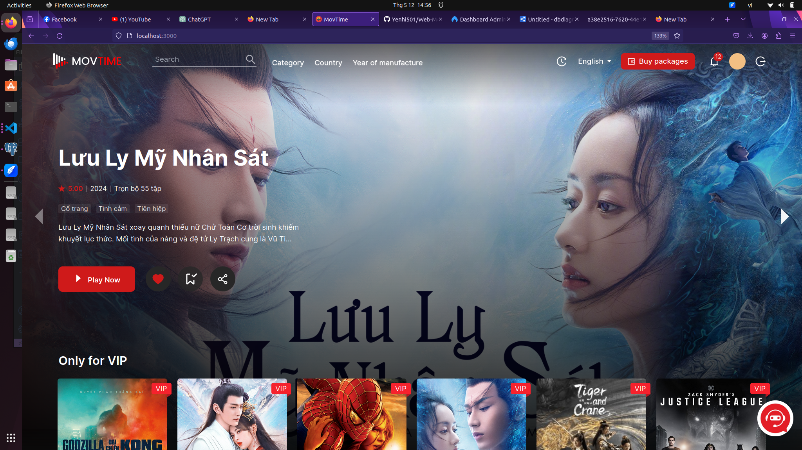

# Movtime Website
### HomePage : 
### Database : https://dbdiagram.io/d/664064229e85a46d559b26f9

# Đề tài: Website xem phim trực tuyến tích hợp hệ thống gợi ý và chatbot

## REQUIREMENT OUTLINE

### A. Các chức năng dự kiến

#### I. Chức năng chung

1. **Chức năng Đăng Nhập**
   - Hệ thống cho phép người dùng sử dụng tài khoản và mật khẩu để đăng nhập vào hệ thống hoặc sử dụng Gmail.

2. **Chức năng Đăng Xuất**
   - Hệ thống cho phép người dùng đăng xuất khỏi hệ thống.

#### II. Chức năng riêng

1. **Admin**

   1.1. **Chức năng quản lý phim**
   - Hệ thống cho phép admin xem danh sách, thêm, sửa, xóa phim.

   1.2. **Chức năng quản lý doanh thu**
   - Hệ thống cho phép admin xem danh sách doanh thu theo tháng, tuần.

   1.3. **Chức năng quản lý tài khoản người dùng**
   - Hệ thống cho phép admin xem danh sách, thêm, sửa, xóa tài khoản người dùng.

   1.4. **Chức năng quản lý gói VIP**
   - Hệ thống cho phép admin xem danh sách, thêm, sửa, xóa gói VIP.

   1.5. **Chức năng quản lý người dùng VIP**
   - Hệ thống cho phép admin xem danh sách, thêm, sửa, xóa người dùng VIP.

   1.6. **Chức năng quản lý đạo diễn/diễn viên**
   - Hệ thống cho phép admin xem danh sách, thêm, sửa, xóa đạo diễn/diễn viên.

   1.7. **Chức năng thêm admin**
   - Hệ thống cho phép tạo admin mới.

   1.8. **Chức năng thống kê**
   - Thống kê tổng thể.
   - Thống kê doanh thu theo ngày/tuần/tháng.
   - Thống kê đạo diễn/diễn viên.
   - Thống kê phim theo thể loại.
   - Thống kê phim theo bình luận.
   - Thống kê người dùng.

2. **User**

   2.1. **Chức năng xem phim**
   - Người dùng có thể xem trailer phim khi chưa đăng nhập và sau khi đã đăng nhập.
   - Người dùng có thể xem phim khi đăng ký gói.

   2.2. **Chức năng tìm kiếm phim**
   - Cho phép người dùng tìm kiếm phim theo các tiêu chí như tên phim, thể loại, đạo diễn, diễn viên, năm sản xuất,...

   2.3. **Chức năng đặt lịch hẹn xem phim**
   - Cho phép người dùng đặt lịch hẹn xem phim sắp chiếu.

   2.4. **Chức năng xem thông tin chi tiết phim**
   - Người dùng có thể xem thông tin chi tiết về phim bao gồm: trailer phim, mô tả phim, đạo diễn, diễn viên, phim liên quan, các tập phim, lượt yêu thích phim.

   2.5. **Chức năng xem thông tin chi tiết đạo diễn/diễn viên**
   - Người dùng có thể xem thông tin cá nhân đạo diễn/diễn viên của từng bộ phim và các phim liên quan đến đạo diễn/diễn viên.

   2.6. **Chức năng đánh giá/bình luận phim**
   - Cho phép người dùng đánh giá về phim.
   - Cho phép người dùng bình luận nội dung phim của từng tập.

   2.7. **Chức năng quản lý thông tin cá nhân**
   - Cho phép người dùng cập nhật và quản lý thông tin cá nhân như hình ảnh, giới tính, ngày sinh,...
   - Người dùng không thể chỉnh sửa username và email.
   - Người dùng có thể đổi mật khẩu.
   - Người dùng có thể xem thông tin gói đã mua.

   2.8. **Chức năng mua gói VIP**
   - Cho phép người dùng có thể mua các gói xem phim.
   - Cho phép người dùng có thể chọn hình thức thanh toán bằng VNPAY/Paypal.

   2.9. **Chức năng lưu vào danh sách xem sau/yêu thích**
   - Cho phép người dùng lưu các bộ phim yêu thích hoặc muốn xem sau.

   2.10. **Chức năng xem lịch sử**
   - Cho phép người dùng có thể xem lịch sử phim đã xem.

   2.11. **Chức năng quên mật khẩu/Đặt mật khẩu mới**
   - Hỗ trợ người dùng trong việc khôi phục mật khẩu bằng cách gửi liên kết đặt lại mật khẩu qua email.

   2.12. **Chức năng Multi Language**
   - Hỗ trợ đa ngôn ngữ cho giao diện người dùng, cho phép người dùng lựa chọn ngôn ngữ phù hợp (i18n).

   2.13. **Chức năng gợi ý phim**
   - Hệ thống gợi ý phim dựa trên lịch sử xem phim và sở thích cá nhân của người dùng (Content-based recommendation).

   2.14. **Chatbot**
   - Chatbot có thể hỗ trợ người dùng trong việc tìm kiếm phim, thông tin phim, thông tin diễn viên, đạo diễn, trả lời các câu hỏi liên quan đến hệ thống... (Sử dụng Langchain và Large Language Model - LLM).
   - Dựa vào sở thích và lịch sử xem phim của người dùng để gợi ý những bộ phim phù hợp nhất.
   - Hỗ trợ hỏi đáp về thông tin một bộ phim bất kỳ trên hệ thống (Tóm tắt phim, hỏi về nội dung phim,...).

   2.15. **Chức năng xem phim cùng nhau**
   - Cho phép người dùng xem phim cùng nhau.

### B. Công nghệ dự kiến sử dụng

1. **Xây dựng giao diện**
   - ReactJs
   - Tailwind CSS
   - Ant Design

2. **Cơ sở dữ liệu**
   - PostgreSQL

3. **Backend**
   - NodeJS
   - Redis
   - Docker

4. **Chatbot**
   - Langchain + LLMs

5. **Dịch vụ lưu trữ**
   - AWS S3: Lưu trữ video + ảnh
   - AWS Cloudfront: CDN giúp tăng tốc độ tải ảnh + video
   - EC2

6. **Thanh toán**
   - Paypal
   - VNPAY

### C. Tài liệu tham khảo

1. [Content-based Recommendation Systems](#)
2. [Langchain](#)
3. [Chatbot-LLMs: Xây dựng chatbot hỏi đáp tài liệu sử dụng mô hình ngôn ngữ lớn GPT-3.5 và thư viện Langchain](#)
--------------------------------------------------------------------------------------------------------------------------------

# Getting Started with Create React App

This project was bootstrapped with [Create React App](https://github.com/facebook/create-react-app).

## Available Scripts

In the project directory, you can run:

### `npm start`

Runs the app in the development mode.\
Open [http://localhost:3000](http://localhost:3000) to view it in the browser.

The page will reload if you make edits.\
You will also see any lint errors in the console.

### `npm test`

Launches the test runner in the interactive watch mode.\
See the section about [running tests](https://facebook.github.io/create-react-app/docs/running-tests) for more information.

### `npm run build`

Builds the app for production to the `build` folder.\
It correctly bundles React in production mode and optimizes the build for the best performance.

The build is minified and the filenames include the hashes.\
Your app is ready to be deployed!

See the section about [deployment](https://facebook.github.io/create-react-app/docs/deployment) for more information.

### `npm run eject`

**Note: this is a one-way operation. Once you `eject`, you can’t go back!**

If you aren’t satisfied with the build tool and configuration choices, you can `eject` at any time. This command will remove the single build dependency from your project.

Instead, it will copy all the configuration files and the transitive dependencies (webpack, Babel, ESLint, etc) right into your project so you have full control over them. All of the commands except `eject` will still work, but they will point to the copied scripts so you can tweak them. At this point you’re on your own.

You don’t have to ever use `eject`. The curated feature set is suitable for small and middle deployments, and you shouldn’t feel obligated to use this feature. However we understand that this tool wouldn’t be useful if you couldn’t customize it when you are ready for it.

## Learn More

You can learn more in the [Create React App documentation](https://facebook.github.io/create-react-app/docs/getting-started).

To learn React, check out the [React documentation](https://reactjs.org/).
